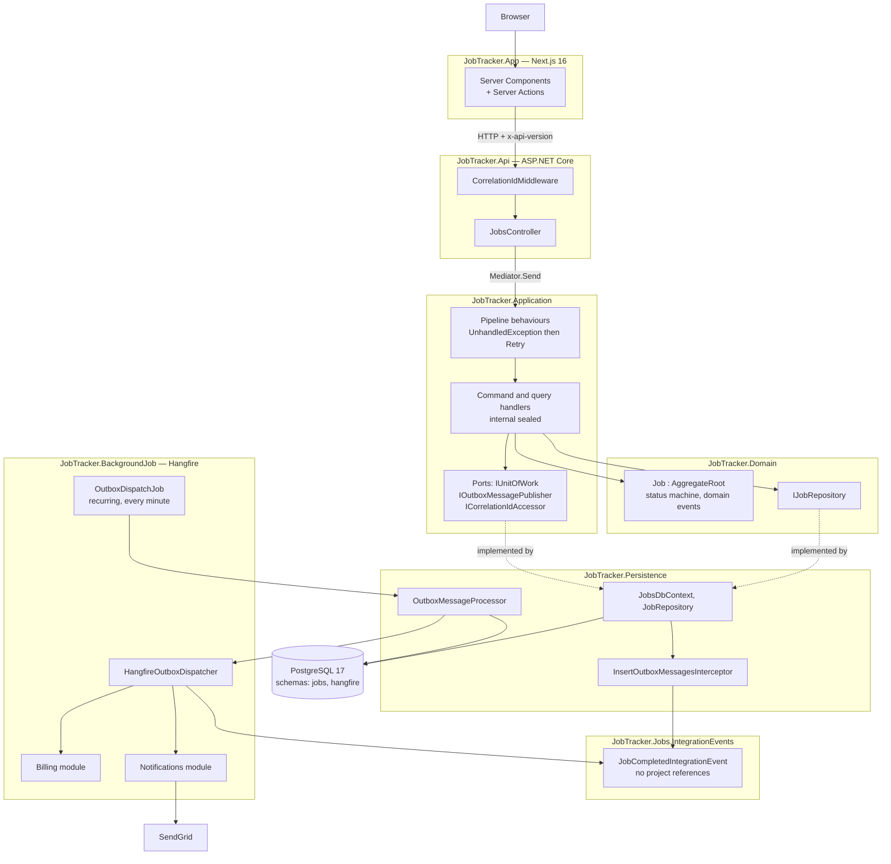
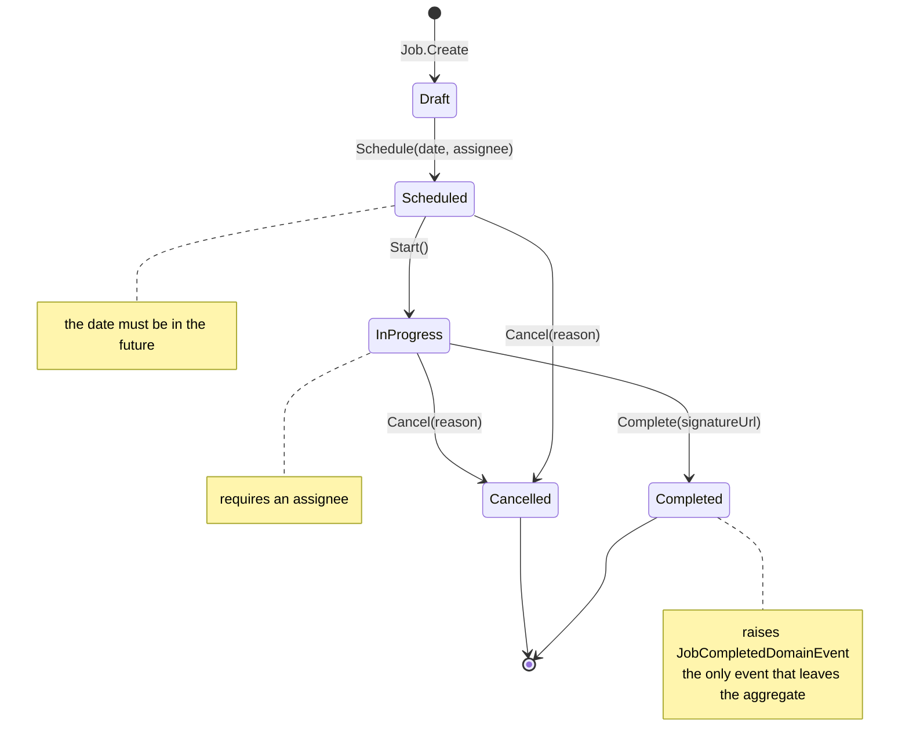
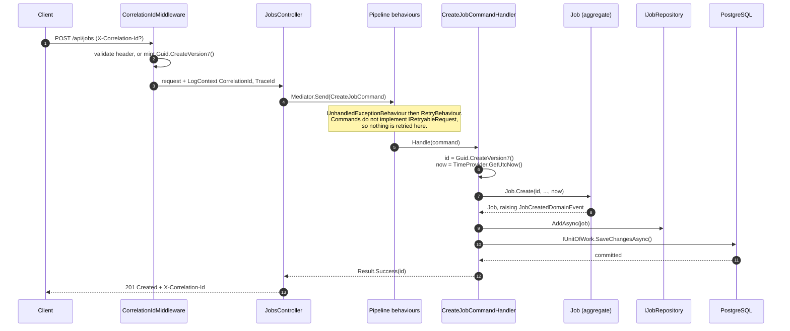
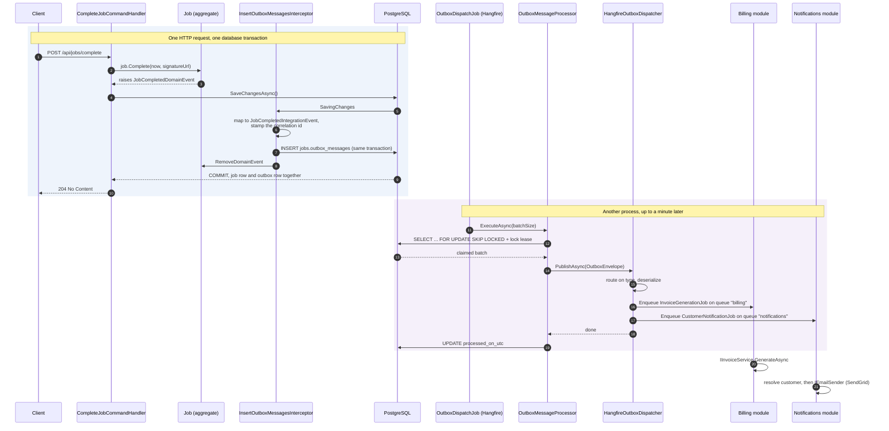
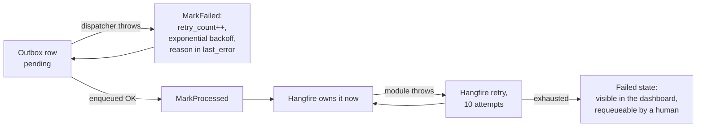
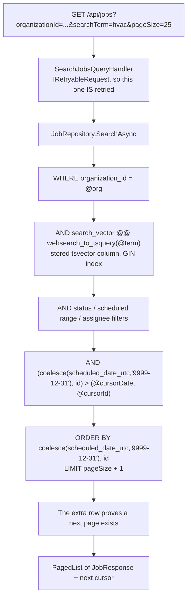
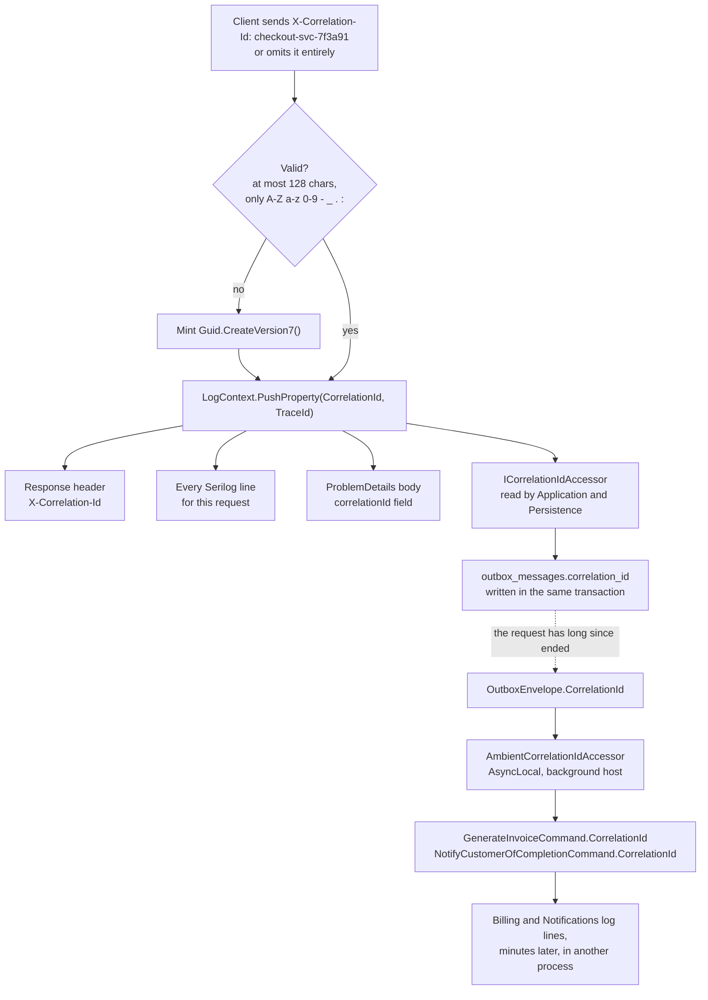
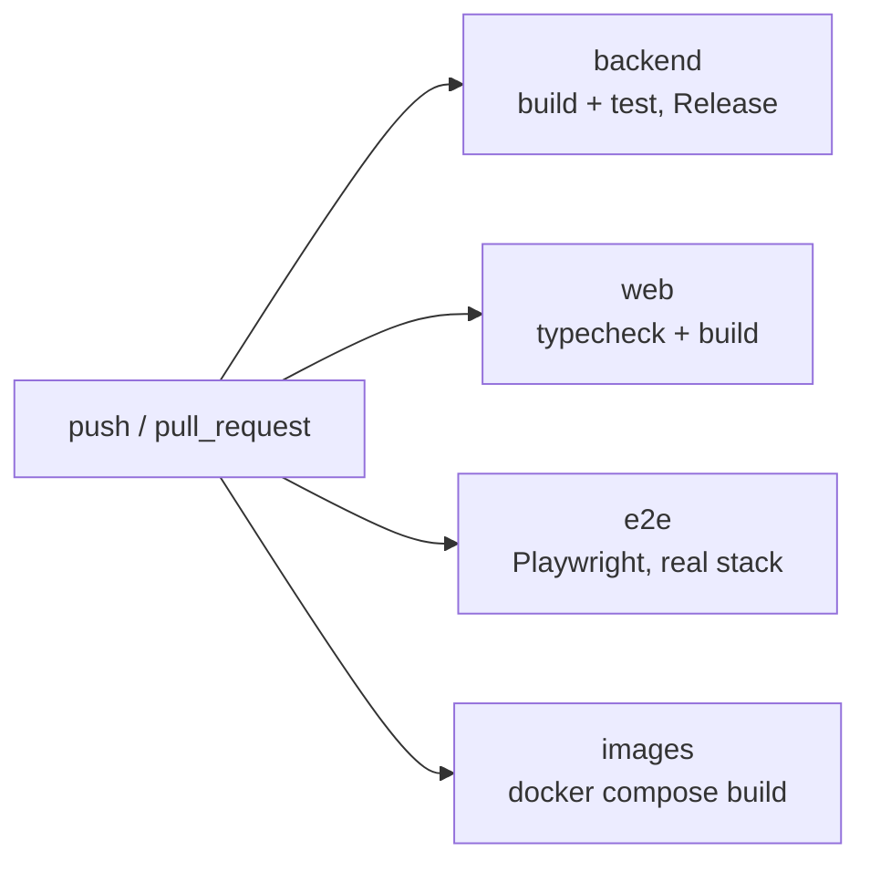

# JobTracker

[](https://github.com/julitogtu/JobTracker/actions/workflows/ci.yml)

A multi-tenant field-service job tracker: a .NET 10 API, a Next.js 16 client, and a Hangfire
worker that turns a completed job into an invoice and a customer email — without ever losing one
to a crash, thanks to the transactional outbox.

It is a demo, but a deliberately realistic one. The interesting parts are not the CRUD; they are
the seams: Clean Architecture with an enforced dependency direction, `Result` instead of
exceptions for expected failures, keyset pagination over PostgreSQL full-text search, an outbox
drained out of process, and a correlation id that survives all of it.

---

## Table of contents

- [Main features](#main-features)
- [Technologies](#technologies)
- [Architecture](#architecture)
- [Getting started](#getting-started)
- [Main flows](#main-flows)
- [Correlation ids](#correlation-ids)
- [API surface](#api-surface)
- [Testing](#testing)
- [Continuous integration](#continuous-integration)
- [Project structure](#project-structure)
- [Known rough edges](#known-rough-edges)

---

## Main features

| Feature | What it means here |
|---|---|
| **Multi-tenant by construction** | Every query is scoped by `OrganizationId`. It is not a filter you can forget — it is a parameter on the repository. |
| **Enforced job lifecycle** | `Draft → Scheduled → InProgress → Completed`, with `Cancelled` reachable from two states. The aggregate rejects every other transition. |
| **Result pattern, not exceptions** | Expected failures return `Result<T>` with a typed `Error`; `ErrorType` maps to the HTTP status. Exceptions are for bugs. |
| **Transactional outbox** | A completed job writes its integration event in the *same transaction* as the status change. No dual-write, no lost event. |
| **Async fan-out via Hangfire** | A background host drains the outbox and dispatches to two independent modules — Billing and Notifications — on separate queues. |
| **Full-text search + keyset paging** | A stored `tsvector` column with a GIN index, paged by an opaque cursor rather than `OFFSET`. |
| **Correlation ids end to end** | One id ties an HTTP request, its logs, its ProblemDetails body, and the background work it triggered minutes later. |
| **Retry policy that knows what is safe** | Polly retries queries; commands deliberately opt out, because retrying a non-idempotent handler in a shared `DbContext` corrupts behaviour. |
| **Server-rendered UI** | Next.js App Router. Every API call happens on the server, so the API needs no CORS policy and the base URL never reaches the browser. |
| **Tested against real infrastructure** | Integration tests run against a real PostgreSQL in Testcontainers; e2e drives a real browser through the whole stack. |

---

## Technologies

**Backend**

| | |
|---|---|
| .NET 10 / C# 14 | Target framework `net10.0` |
| MediatR | CQRS dispatch + pipeline behaviours |
| FluentValidation | Request-shape validation |
| EF Core 10 + Npgsql | Persistence, migrations, interceptors |
| PostgreSQL 17 | `tsvector` search, `FOR UPDATE SKIP LOCKED`, `jsonb` |
| Hangfire 1.8 | Background scheduling, storage in its own `hangfire` schema |
| Polly v8 | Retry resilience pipeline |
| Serilog | Structured logging with `LogContext` enrichment |
| Asp.Versioning | Versioning via the `x-api-version` header |
| Scalar | API reference UI (Development only) |
| SendGrid | Customer email delivery |

**Frontend**

| | |
|---|---|
| Next.js 16 (App Router) | Server Components + Server Actions |
| React 19 | |
| Zustand | Client-side view state |
| TypeScript 5.9 | |

**Testing & tooling**

| | |
|---|---|
| xUnit v3 on Microsoft.Testing.Platform | Unit + integration suites |
| Testcontainers | A real PostgreSQL per test run |
| FluentAssertions | Assertions |
| Playwright | Browser end-to-end suite |
| Docker Compose | The whole stack in one command |
| GitHub Actions | CI |

---

## Architecture

Clean Architecture, with the dependency arrows pointing inward. `Domain` knows about nothing;
`Application` knows about `Domain`; everything else depends on those two.



**Two projects sit outside the layered stack.**
`JobTracker.Jobs.IntegrationEvents` is the published contract — what leaves the Jobs boundary — and
has **no project references at all**, so a consumer can depend on the shape of an event without
pulling in the aggregate, EF or MediatR. `JobTracker.BackgroundJob` is the async host; it is the
only process that knows Billing and Notifications exist.

**The Api references Persistence for exactly one line** — `AddPersistence(connectionString)` at
startup. It never touches an EF type.

---

## Getting started

### Prerequisites

- [Docker Desktop](https://www.docker.com/products/docker-desktop/) — required; the integration and e2e tests need it too
- [.NET 10 SDK](https://dotnet.microsoft.com/download) — only if you want to run the hosts outside containers
- [Node.js 24+](https://nodejs.org) — only if you want to run the UI outside containers

### Option A — the whole stack in one command

```bash
git clone https://github.com/julitogtu/JobTracker.git
cd JobTracker

docker compose up -d --build
```

That builds and starts five services:

| Service | URL | Notes |
|---|---|---|
| `postgres` | `localhost:5432` | container name `jobtracker-postgres` |
| `migrator` | — | applies the EF migrations, then exits |
| `api` | http://localhost:5240 | Scalar reference at `/scalar` |
| `backgroundjob` | http://localhost:5241 | Hangfire dashboard at `/hangfire` |
| `app` | http://localhost:3001 | the UI |

Open **http://localhost:3001** and you have a working system.

> **The `migrator` service is not optional.** Neither host applies migrations on boot, so without
> it the `jobs` schema would not exist and every request would fail. `api` and `backgroundjob`
> both wait on it completing successfully.

Stop it, and reclaim the database volume:

```bash
docker compose down          # stop
docker compose down -v       # stop and delete the data
```

### Option B — run the services from source

The compose ports (5240 / 5241 / 3001) deliberately avoid the launch-profile ports
(5238 / 5239 / 3000), so **you can run the whole stack and a local host at the same time** — which
is the normal case when you are working on one service and want the other three just running.

**1. Start PostgreSQL**

```bash
docker compose up -d postgres
```

**2. Apply the migrations**

`JobsDbContextFactory` is the design-time context and reads `JOBTRACKER_CONNECTION_STRING`, which
is why Persistence acts as its own startup project:

```powershell
# PowerShell
$env:JOBTRACKER_CONNECTION_STRING="Host=localhost;Port=5432;Database=jobtracker;Username=jobtracker;Password=jobtracker_dev_password;SSL Mode=Disable"
dotnet ef database update --project src/JobTracker.Persistence --startup-project src/JobTracker.Persistence
```

```bash
# bash
export JOBTRACKER_CONNECTION_STRING="Host=localhost;Port=5432;Database=jobtracker;Username=jobtracker;Password=jobtracker_dev_password;SSL Mode=Disable"
dotnet ef database update --project src/JobTracker.Persistence --startup-project src/JobTracker.Persistence
```

**3. Run the API** — http://localhost:5238, Scalar at `/scalar`

```bash
dotnet run --project src/JobTracker.Api --launch-profile http
```

**4. Run the background host** — http://localhost:5239, dashboard at `/hangfire`

```bash
dotnet run --project src/JobTracker.BackgroundJob --launch-profile http
```

**5. Run the UI** — http://localhost:3000/jobs

```bash
cd src/JobTracker.App
npm install
npm run dev
```

### Try it end to end

Create a job, walk it through the lifecycle, and watch the async side pick it up:

```bash
ORG=8f6c1b52-1f3d-4a2e-9c77-2b1d5f0e4a10
API=http://localhost:5240        # or 5238 if you are running from source

# 1. Create it — scheduled, so it starts in Scheduled rather than Draft
JOB=$(curl -s -X POST $API/api/jobs \
  -H "Content-Type: application/json" \
  -H "X-Correlation-Id: my-first-job" \
  -d '{"title":"Fix HVAC","description":"Replace the failed compressor.",
       "street":"123 Main St","city":"Austin","state":"TX","zipCode":"78701",
       "latitude":30.2672,"longitude":-97.7431,
       "customerId":"11111111-2222-4333-8444-555555555555","organizationId":"'$ORG'",
       "scheduledDateUtc":"2030-01-01T09:00:00Z","assigneeId":"99999999-8888-4777-8666-555555555555"}' \
  | sed -E 's/.*"id":"([^"]+)".*/\1/')

# 2. Start it, then complete it
curl -s -X POST $API/api/jobs/start -H "Content-Type: application/json" \
  -H "X-Correlation-Id: my-first-job" -d '{"organizationId":"'$ORG'","jobId":"'$JOB'"}'

curl -s -X POST $API/api/jobs/complete -H "Content-Type: application/json" \
  -H "X-Correlation-Id: my-first-job" \
  -d '{"organizationId":"'$ORG'","jobId":"'$JOB'","signatureUrl":"https://example.com/sig.png"}'
```

Within a minute the background host drains the outbox. Its log shows the invoice and the email —
both tagged with `my-first-job`:

```
[12:32:07 INF] [my-first-job] Job 01a08626-... completed: queued invoice generation and customer notification.
[12:32:07 INF] [my-first-job] Billing: raising invoice for job 01a08626-... Idempotency key 01a08626...
[12:32:07 INF] [my-first-job] No SendGrid API key configured, so this mail was not sent. To: dev-inbox@jobtracker.local ...
```

```bash
docker compose logs -f backgroundjob
```

`JobTracker.postman_collection.json` at the repo root has worked examples of every request body.

---

## Main flows

### 1. Job lifecycle (the state machine)

The aggregate is the only thing that can move a job between states, and it refuses every
transition not drawn here. `Completed` and `Cancelled` are terminal.



`Job.Create` can jump straight to `Scheduled` if given a date and an assignee together — supplying
one without the other is rejected.

### 2. Creating a job (synchronous request flow)

Every write follows this path. Note where the two guards sit: the validator checks the *request
shape*, the aggregate checks the *domain rule*. Both, deliberately.



**On failure** the handler returns `Result.Failure(new Error("Jobs.Create....", ..., ErrorType))`,
and `ApiControllerBase.ToProblem` maps it:

| `ErrorType` | HTTP |
|---|---|
| `Validation` | 400 |
| `Unauthorized` | 401 |
| `Forbidden` | 403 |
| `NotFound` | 404 |
| `Conflict` | 409 |
| anything else | 500 |

The ProblemDetails body carries a `correlationId` field, so a caller reporting a failure can quote
an id that finds the request.

### 3. Completing a job (the asynchronous flow)

This is the flow the whole design exists for. A completed job has to raise an invoice and email
the customer — two things that must not be lost, must not be done twice in a way that matters, and
must not hold the HTTP request open.



**Why an outbox at all.** The alternative is writing the job update to PostgreSQL and publishing
the event to a broker — two systems, no shared transaction. Crash between them and you have either
a completed job nobody billed for, or an invoice for a job that was never completed. The outbox
turns that into a single commit; delivery becomes a separate, retryable problem.

**Failure handling at each stage:**



An unrecognised event type or an unreadable payload **throws** rather than being skipped. Marking
such a row processed would make the backlog disappear along with the invoice.

> **Delivery is at-least-once, twice over.** If the second `Enqueue` throws, the row is never
> marked processed and the next drain enqueues both again; and Hangfire itself can run a job
> twice. Both module commands therefore carry the event's `IdempotencyKey` — and **the two module
> implementations are stubs that do not yet dedupe on it.** That is the first thing to add when
> either starts doing real work.

### 4. Searching jobs (full-text + keyset paging)

Paging is cursor-based, not `OFFSET`-based: an opaque base64url cursor encodes the
`(ScheduledDateUtc, JobId)` of the last row, and the next page is a row-value comparison against
it. Stable under concurrent inserts, and it does not get slower deeper into the results.



`pageSize` is clamped to 1–100 in the repository, so a client cannot ask for the whole table.

---

## Correlation ids

A single request can touch the browser, the Next server, the API, PostgreSQL, and — minutes later,
in a different process — Hangfire, Billing and SendGrid. When something goes wrong, "which request
caused this?" has to be answerable from a log line.



**The inbound header is validated, not trusted.** It goes into every log line for the request, so
an unvalidated value would let a caller forge log entries with newlines and inflate log storage at
will. Anything over 128 characters or outside `[A-Za-z0-9-_.:]` is discarded and a fresh id minted.

**How to reach it:**

| From | Use |
|---|---|
| Api | `HttpContext.GetCorrelationId()` |
| Application / Persistence | `ICorrelationIdAccessor` — returns `"none"` when no request is in scope, so a hosted service can depend on it safely |
| Background host | `AmbientCorrelationIdAccessor`, restored from the outbox row |

**Two registration-order traps**, both silent if you get them wrong:

- `Enrich.FromLogContext()` is load-bearing. Without it `LogContext.PushProperty` enriches
  nothing — the header is still returned and the logs are still written, so it looks like it
  works, but the id is nowhere.
- `AddPersistence` registers `NullCorrelationIdAccessor` with `TryAddScoped`. Both hosts register
  their real accessor **before** calling it. Swap those two lines and every outbox row silently
  reverts to `none`.

**What it buys you.** A row drained minutes after the request ended still names the request that
caused it:

```
[12:31:37 INF] [checkout-svc-7f3a91] HTTP POST /api/jobs/complete responded 204
...
[12:32:07 INF] [checkout-svc-7f3a91] Job 01a08626-... completed: queued invoice generation and customer notification.
[12:32:07 INF] [checkout-svc-7f3a91] Billing: raising invoice for job 01a08626-...
[12:32:07 INF] [checkout-svc-7f3a91] Notifying customer 11111111-... that job 01a08626-... is complete.
```

Grep one id and you have the whole causal chain, across two processes and a minute of wall time.

**Still missing:** outbound propagation. When this service starts calling others, an outgoing
`HttpClient` needs a `DelegatingHandler` that forwards the header, and the outbox publisher needs
to put it on the wire as a message header.

---

## API surface

All endpoints are versioned via the `x-api-version` header (default `1.0`, assumed when absent).

| Method | Route | Description |
|---|---|---|
| `GET` | `/` | Health check |
| `GET` | `/api/jobs/{organizationId}/{jobId}` | Fetch one job |
| `GET` | `/api/jobs` | Search — `organizationId`, `searchTerm`, `statuses`, `scheduledFromUtc`, `scheduledToUtc`, `assigneeId`, `cursor`, `pageSize` |
| `POST` | `/api/jobs` | Create a job (optionally scheduled) |
| `POST` | `/api/jobs/start` | `Scheduled` to `InProgress` |
| `POST` | `/api/jobs/complete` | `InProgress` to `Completed`, raises the integration event |

Error codes follow `Jobs.<Operation>.<Reason>` — for example `Jobs.Start.InvalidStatus`.

---

## Testing

```bash
# Everything. --solution is required: global.json opts into Microsoft.Testing.Platform,
# and a bare `dotnet test` reports "Zero tests ran" instead of failing.
dotnet test --solution JobTracker.slnx

# One class
dotnet test --project tests/JobTracker.Tests/JobTracker.Tests.csproj -- --filter-class "*JobTests"
```

| Suite | Location | Needs |
|---|---|---|
| Domain unit tests | `tests/.../Domain/` | nothing |
| Application unit tests | `tests/.../Application/` | nothing |
| Background-host unit tests | `tests/.../BackgroundJob/` | nothing |
| Integration tests | `tests/.../Integration/` | **Docker** — one `postgres:17-alpine` Testcontainer for the run |
| End-to-end | `src/JobTracker.App/e2e/` | **Docker** + Chrome |

Integration tests share one database and isolate by **tenant**: each test instance gets a fresh
`OrganizationId`, and since every repository query is tenant-scoped, no truncation is needed
between tests. Outbox rows are the exception — that table has no organization column — so outbox
assertions match on the job id inside the `jsonb` payload.

### End-to-end

```bash
docker compose up -d postgres     # the suite resets its tenant via docker exec ... psql
cd src/JobTracker.App
npm run test:e2e                  # browser -> Next -> .NET API -> PostgreSQL
npm run test:e2e -- --grep completing
npm run test:e2e:ui               # Playwright UI mode
```

Run them through `npm run test:e2e`, **not** `npx playwright test`: the wrapper mints a fresh
`JOBTRACKER_ORGANIZATION_ID` per run, which is what gives the run a private slice of the shared
database. The config starts both servers itself (API on 5238, Next on **3100** so an existing
`npm run dev` on 3000 is untouched).

---

## Continuous integration

`.github/workflows/ci.yml` runs on pushes to `main`, on every pull request, and on demand.



Four jobs in parallel. Two notes on why they are shaped this way:

- **Release, not Debug.** Test ordering differs between configurations, and the integration suite
  shares one outbox table with no tenant column — so an assertion that quietly assumes it only
  sees its own rows passes in one configuration and fails in the other.
- **`images` earns its slot.** The Dockerfiles carry hand-written restore lists, so adding a
  project to the solution can leave them copying a tree that no longer compiles — something
  `dotnet build` will never notice.

---

## Project structure

```
JobTracker/
├── .github/workflows/ci.yml
├── docker-compose.yaml                    # postgres, migrator, api, backgroundjob, app
├── Directory.Packages.props               # central NuGet versions; csproj files carry no Version
├── JobTracker.slnx
├── src/
│   ├── JobTracker.Domain/                 # aggregate, value objects, domain events, repository port
│   ├── JobTracker.Application/            # CQRS handlers, Result/Error, behaviours, ports
│   ├── JobTracker.Jobs.IntegrationEvents/ # published contracts, no project references
│   ├── JobTracker.Persistence/            # EF Core, configurations, outbox, migrations
│   ├── JobTracker.Api/                    # controllers, middleware, filters, Program.cs
│   ├── JobTracker.BackgroundJob/          # Hangfire host
│   │   ├── Outbox/                        #   drain and dispatch
│   │   ├── Billing/                       #   bounded context: invoice generation
│   │   └── Notifications/                 #   customer email via SendGrid
│   └── JobTracker.App/                    # Next.js 16 client
└── tests/
    └── JobTracker.Tests/                  # unit, integration and background-host suites
```

---

## Known rough edges

These are deliberate and load-bearing — documented rather than silently "fixed":

- **`dotnet test` needs an explicit target.** The .NET 10 SDK dropped VSTest; the repo opts into
  Microsoft.Testing.Platform in `global.json`, and the bare form reports "Zero tests ran" instead
  of failing. Filters go after `--` (`-- --filter-class "*JobTests"`).
- **Both async modules are stubs.** `InvoiceService` logs the invoice it would raise, and neither
  module dedupes on `IdempotencyKey` yet.
- **The outbox drain is a minutely cron**, so a completed job waits up to a minute.
  `OutboxDispatch:CronExpression` is the knob; Hangfire's floor is one minute.
- **The Hangfire dashboard is Development-only** and authorized by a filter that allows everyone.
  Hangfire's default allows local requests only, which 401s from outside a container. Serving it
  anywhere but a developer machine needs a real filter.
- **The rate limiter is configured but never used** — `Program.cs` never calls
  `app.UseRateLimiter()`, and `PermitLimit` is 2/minute, so enabling it will break normal usage
  until tuned.
- **FluentValidation validators are registered but nothing runs them** — there is no validation
  pipeline behaviour, so they are currently dead code.
- **MediatR 14 is RPL-1.5 or commercial**, not Apache-2.0 like 12.x. Unlicensed use logs a warning
  on every start; allowed for development, not for production. Set `MEDIATR_LICENSE_KEY` when that
  matters.
- **FluentAssertions 8.10 is free for non-commercial use only** and prints an Xceed licence
  warning on every test run.
- **`appsettings.json` contains the dev connection string with a plaintext password**, matching
  `docker-compose.yaml`. A `UserSecretsId` is set on the Api project for real secrets.

`CLAUDE.md` carries the deeper design notes — retry semantics, persistence conventions, and the
reasoning behind each of the above.
